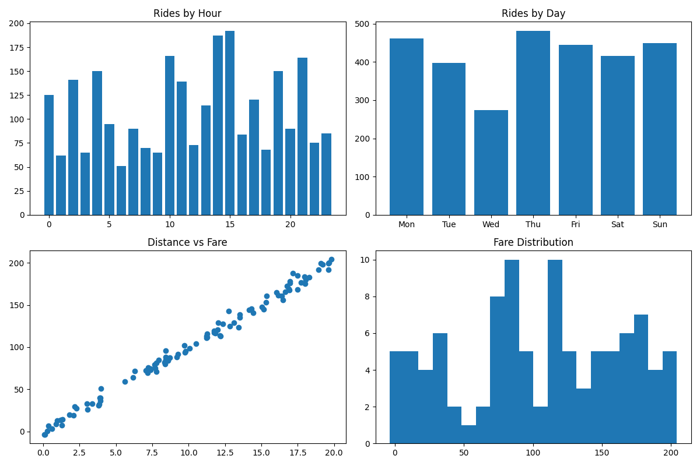

# Uber-Ride-Analysis

Uber ride data analysis dashboard using Python & Power BI

---

## 📌 Project Overview

This project analyzes Uber ride data to understand ride patterns, pricing trends, and customer behavior. It helps identify peak hours, demand trends, and factors affecting fare prices.

---

## 📊 Dataset

* Uber Fares Dataset (Kaggle)
* Includes fare, date/time, location, and passenger details

---

## 🛠️ Tools Used

* Python (Pandas, NumPy, Matplotlib)
* Jupyter Notebook
* Power BI

---

## ⚙️ Workflow

* Data Cleaning
* Feature Engineering (Hour, Day, Month)
* Distance Calculation
* Exploratory Data Analysis
* Dashboard Creation

---

## 📈 Key Insights

* Peak rides occur during evening hours
* Fare increases with distance
* Most rides have 1–2 passengers
* Higher demand on weekends

---

## 📊 Dashboard



---

## 📁 Project Structure

```
Uber-Ride-Analysis/
│
├── notebooks/
│   └── uber_ola.ipynb
│
├── images/
│   └── uber_dashboard.png
│
├── README.md
└── requirements.txt
```

---

## 🚀 How to Run

```
pip install -r requirements.txt
jupyter notebook
```

---

## 👩‍💻 Author

Yashaswi Munthala
